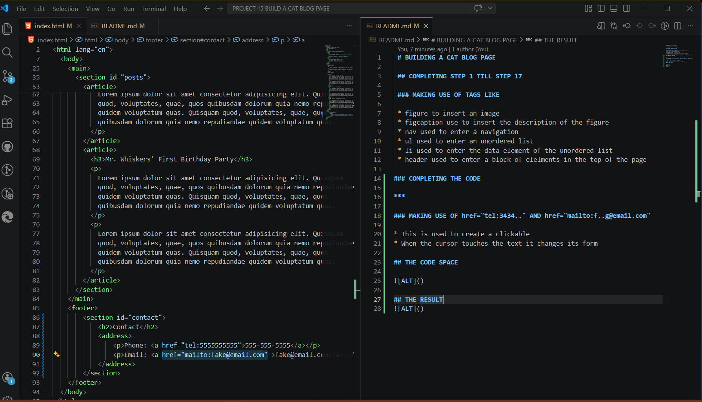
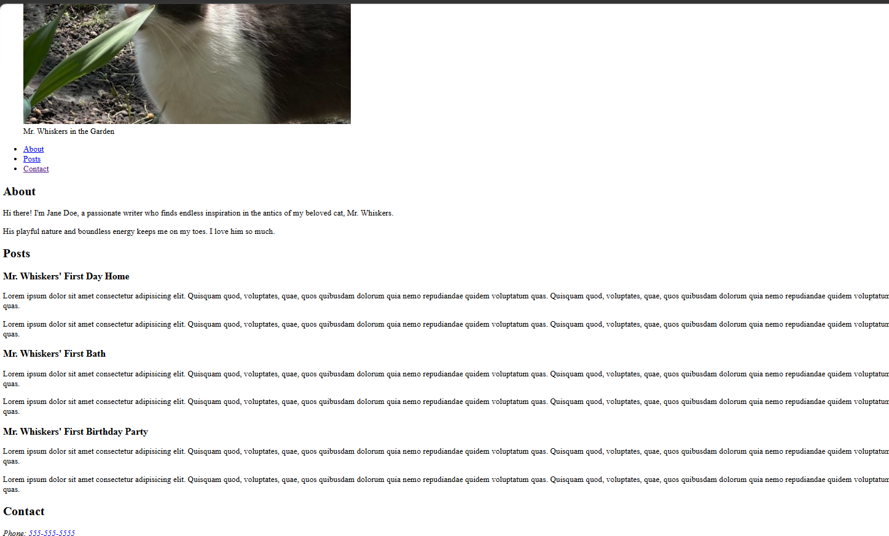

 # BUILDING A CAT BLOG PAGE

 ## COMPLETING STEP 1 TILL STEP 17

 ### MAKING USE OF TAGS LIKE 

 * figure to insert an image
 * figcaption use to insert the description of the figure
 * nav used to enter a navigation
 * ul used to enter an unordered list
 * li used to enter the data element of the unordered list
 * header used to enter a block of elelments in the top of the page 

### COMPLETING THE CODE

*** 

### MAKING USE OF href="tel:3434.." AND href="mailto:f..g@email.com"

* This is used to create a clickable
* When the cursor touches the text it changes its form

## THE CODE SPACE

## THE RESULT
